# CAMELYON16 Pathology Audit Project (DS340W)

## From Attention to Audit: Testing Whether Pathology AI Uses Real Morphology or Visual Shortcuts

This project studies whether a pathology AI model truly relies on medical morphology when making cancer predictions, or whether it may rely on simple visual shortcuts such as blur, color, stain, brightness, or small artifacts.

The project uses CAMELYON16 whole-slide images and builds a lightweight audit workflow. The workflow starts from whole-slide preprocessing, extracts frozen patch features, trains an attention-based MIL model, exports high-attention patches, applies controlled perturbations, and then compares model behavior before and after the visual changes.

The main idea is simple:

A model can get the right answer, but still use the wrong evidence.

In medical AI, this is important because doctors and patients do not only need high accuracy. They also need stable and trustworthy model behavior.

---

## Project Question

**Does pathology AI rely on real biological morphology, or spurious visual cues?**

This project tries to answer that question by testing whether the model remains stable when small visual changes are applied to important tissue patches.

---

## Why This Problem Matters

High accuracy does not always mean correct reasoning.

A pathology model may predict cancer correctly, but it may not focus on real biological tissue patterns. It may instead react to easy visual shortcuts, such as color tone, stain intensity, sharpness, or small image artifacts.

The example below shows the idea. A patch can visually change after color or style adjustment, but the medical meaning of the tissue may still be similar. If the model changes its prediction too much, that may suggest unstable reasoning.

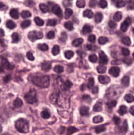
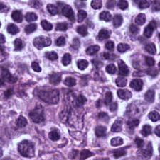

This matters because medical AI needs trust, not just benchmark performance.

---

## Prior Work

This project is inspired by recent large pathology AI models and foundation model research. These papers show that pathology AI is becoming stronger, larger, and more useful. However, they also leave an important question: even if a model performs well, can we trust the way it reasons?

### Prior Work 1

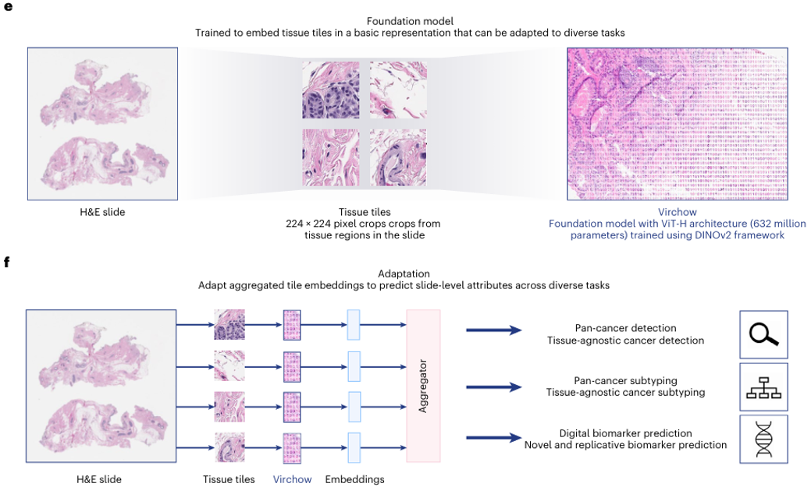

The first prior work shows how large pathology foundation models can learn strong visual representations from histology images. These models can support many downstream tasks, such as cancer detection, subtyping, and biomarker prediction.

This is powerful, but strong performance alone does not prove that the model uses medically valid evidence.

### Prior Work 2

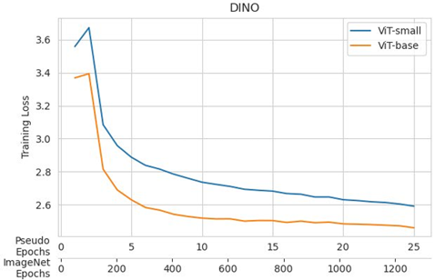

The second prior work shows the importance of large-scale pathology pretraining. It suggests that seeing more pathology data can help the model learn stronger tissue representations.

This supports the idea that pathology AI can become much stronger with scale.

### Prior Work 3

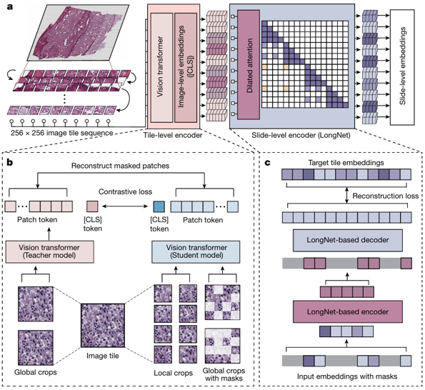

The third prior work moves closer to whole-slide-level understanding. This is important because real pathologists do not only look at isolated patches. They also consider larger tissue context.

Together, these papers show that pathology AI is becoming stronger. But my project focuses on the remaining trust gap.

---

## Research Gap

Existing methods can often show where a model is looking, but seeing attention is not the same as proving correct reasoning.

A heatmap may highlight an important region, but we still do not know whether the model is using real morphology or a shortcut.

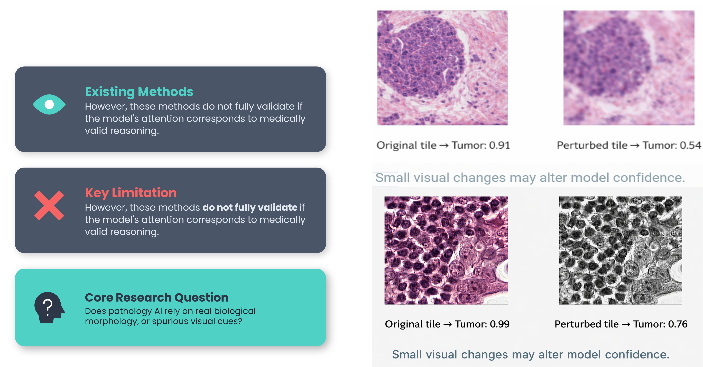

This project tries to move from simple attention visualization to an audit workflow. Instead of only asking “where does the model look?”, it also asks “does the model stay stable when the image changes in medically harmless ways?”

---

## Overall Workflow

The project has three major engines:

1. **Preprocessing**
2. **Engine A: MIL Training**
3. **Engine B: Perturbation Audit**
4. **Engine C: Audit Viewer**

---

## Preprocessing

CAMELYON16 whole-slide images are very large. Many WSI files are several gigabytes each, so they cannot be directly passed into a normal deep learning model.

The preprocessing stage cuts whole-slide images into smaller tissue patches, removes low-tissue background regions, and prepares the data for feature extraction.

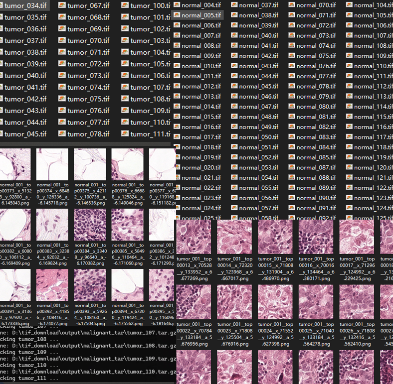

In this project, the preprocessing pipeline was built around the CAMELYON16 dataset. The processed WSI cases were converted into patch-level data, and then frozen features were extracted for MIL training.

Main preprocessing steps:

- Load CAMELYON16 whole-slide images
- Detect tissue regions
- Cut tissue into patches
- Save patch coordinates
- Extract frozen patch features
- Build slide-level feature bags

This stage is one of the hardest parts of the project because WSI data is extremely large. If preprocessing is unstable, then everything after it becomes unstable too.

---

## Engine A: Attention-Based MIL Training

Engine A trains an attention-based Multiple Instance Learning model.

The input is a slide-level bag of patch features. The model makes a slide-level prediction and also assigns attention scores to patches.

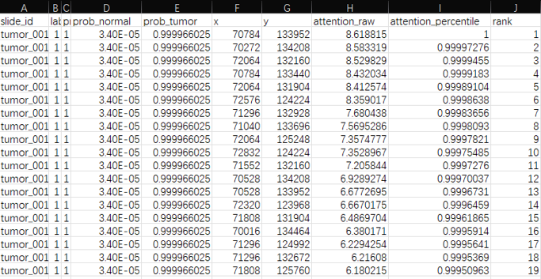

The attention scores help identify which patches are most important for the model’s prediction.

Engine A outputs:

- Slide-level prediction
- Tumor probability
- Patch attention scores
- Patch coordinates
- Ranked patch list
- Top 5% high-attention patches

The top-ranked patches are then used as input for the audit stage.

---

## Engine B: Lightweight Perturbation Audit

Engine B applies controlled perturbations to high-attention patches.

The goal is not to change the medical meaning of the tissue. The goal is to slightly change visual conditions and test whether the model is stable.

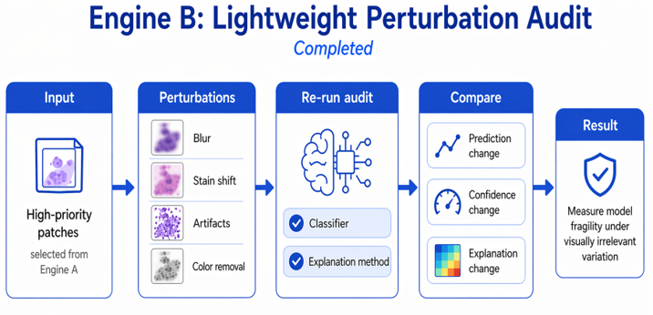

Perturbations include:

- Gaussian blur
- Stain shift
- Brightness shift
- Color removal
- Small artifacts

After perturbation, the model runs again on the changed patch. Then the original output and perturbed output are compared.

The audit checks:

- Did the prediction flip?
- Did the confidence drop?
- Did the explanation map shift?

---

## Engine C: Audit Viewer

The final interface is a lightweight audit viewer.

It shows the original patch and perturbed patch side by side. It also shows tumor probability, confidence drop, prediction flip, and explanation maps.

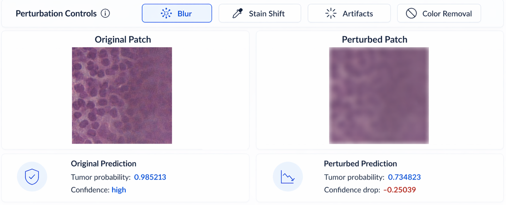

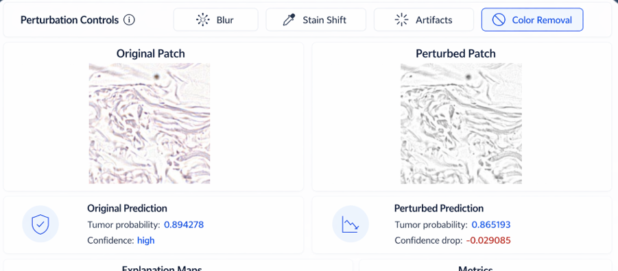

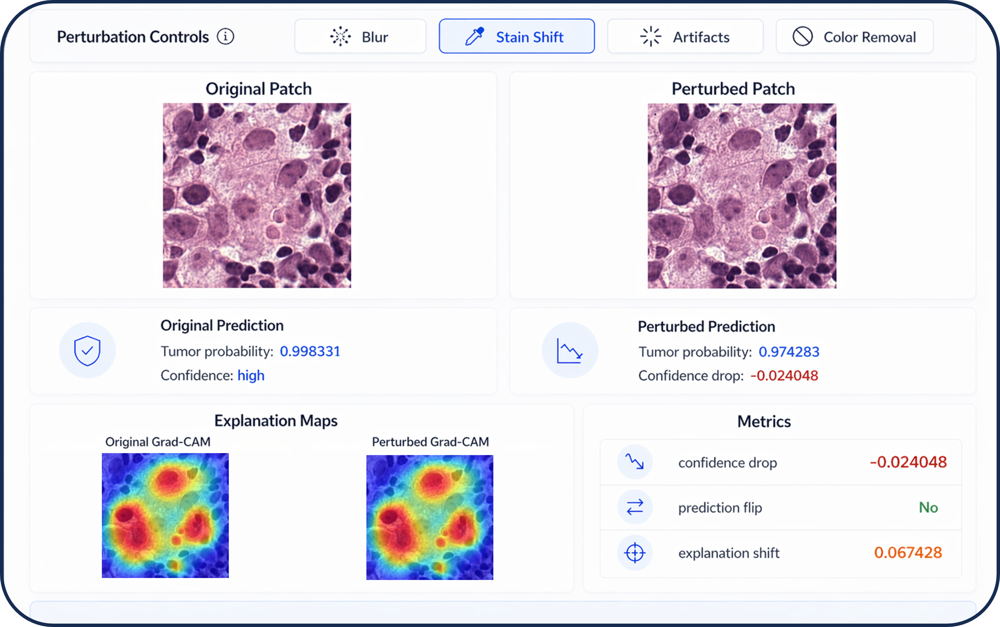

The UI is useful because it makes the audit result easier to understand. Instead of only looking at CSV files, the user can visually inspect how the model behaves before and after perturbation.

---

## Metrics

The project uses both baseline performance metrics and audit metrics.

### Baseline Metrics

- Accuracy
- F1-score
- ROC-AUC

These metrics show whether the model can perform the basic classification task.

### Audit Metrics

#### 1. Prediction Flip Rate

This measures how often the predicted class changes after perturbation.

A high flip rate means the model is easy to shake.

#### 2. Mean Confidence Drop

This measures the average change in tumor probability after perturbation.

A large confidence drop may suggest that the model depends heavily on that visual feature.

#### 3. Explanation Shift

This measures how much the explanation map changes after perturbation.

If the explanation shifts a lot, the model may no longer focus on the same region.

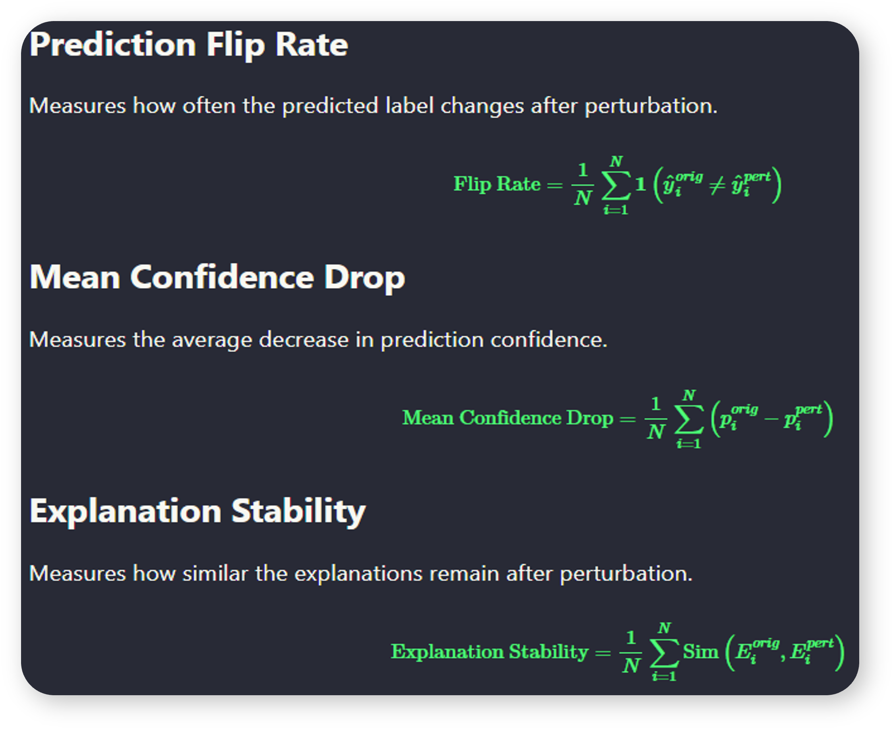

---

## Results

The audit results show that different perturbations affect the model in different ways.

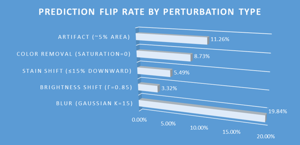

Blur caused the strongest model reaction. It produced the highest prediction flip rate and the largest confidence drop.

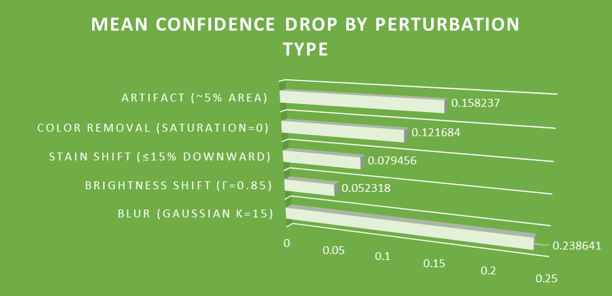

Brightness shift was more stable. It caused fewer prediction flips and preserved the explanation map better.

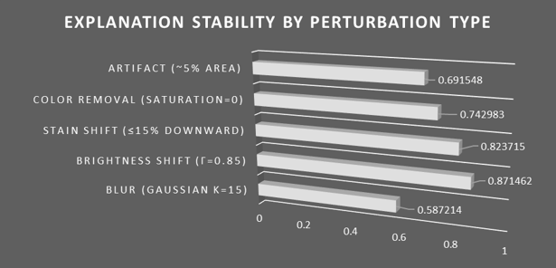

Color removal and artifacts were in the middle. They did not always flip the prediction, but they still changed confidence and explanation maps.

The key result is that the model is not equally robust to all visual changes. This kind of fragility may not be visible from accuracy alone.

---

## References

### Paper 1: Foundation Model / Virchow

Vorontsov, E., Bozkurt, A., Casson, A., Shaikovski, G., Zelechowski, M., Severson, K., Zimmermann, E., Hall, J., Tenenholtz, N., Fusi, N., Yang, E., Mathieu, P., van Eck, A., Lee, D., Viret, J., Robert, E., Wang, Y. K., Kunz, J. D., Lee, M. C. H., Bernhard, J. H., Godrich, R. A., Oakley, G., Millar, E., Hanna, M., Wen, H., Retamero, J. A., Moye, W. A., Yousfi, R., Kanan, C., Klimstra, D. S., Rothrock, B., Liu, S., & Fuchs, T. J. (2024). *A foundation model for clinical-grade computational pathology and rare cancers detection*. Nature Medicine, 30, 2924–2935. https://doi.org/10.1038/s41591-024-03141-0

This paper is used as the first prior work. It introduces Virchow, a large pathology foundation model for computational pathology and rare cancer detection.

### Paper 2: Health System Scale / 13_Computational_Pathology

Campanella, G., Vanderbilt, C., & Fuchs, T. J. (2023). *Computational Pathology at Health System Scale – Self-Supervised Foundation Models from Billions of Images*.

This paper is used as the second prior work. It discusses large-scale self-supervised pathology foundation models trained from billions of pathology image tiles.

### Paper 3: Prov-GigaPath

Xu, H., Usuyama, N., Bagga, J., Zhang, S., Rao, R., Naumann, T., Wong, C., Gero, Z., González, J., Gu, Y., Xu, Y., Wei, M., Wang, W., Ma, S., Wei, F., Yang, J., Li, C., Gao, J., Rosemon, J., Bower, T., Lee, S., Weerasinghe, R., Wright, B. J., Robicsek, A., Piening, B., Bifulco, C., Wang, S., & Poon, H. (2024). *A whole-slide foundation model for digital pathology from real-world data*. Nature, 630, 181–188. https://doi.org/10.1038/s41586-024-07441-w

This paper is used as the third prior work. It introduces Prov-GigaPath, a whole-slide pathology foundation model based on real-world data and whole-slide-level modeling.

---

## Project Structure

```text
camelyon16_audit_project_v2/
  requirements.txt
  README.md
  run_pipeline.py
  run_pipeline_debug.py
  cmd_runner.py
  assets/
    patch1.png
    patch1_colored.png
    paper1.png
    paper2.png
    paper3.png
    research1.png
    preprocessing.png
    enginea.png
    engineb.png
    metrics.png
    result1.png
    result2.png
    result3.png
    ui1.png
    ui2.png
    ui3.png
  src/
    config/
      settings.py
      paths.py
    utils/
      io_utils.py
      logging_utils.py
      seed_utils.py
    data/
      slide_registry.py
      wsi_dataset.py
      wsi_preprocess.py
    features/
      phikon_wrapper.py
    models/
      mil_backbone.py
      attention_mil.py
    train/
      losses.py
      train_mil.py
    infer/
      rank_export.py
    audit/
      perturbations.py
      metrics.py
      heatmaps.py
      audit_runner.py
    ui/
      viewer_app.py
    api/
      api_server.py
